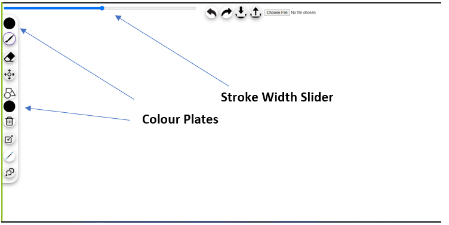
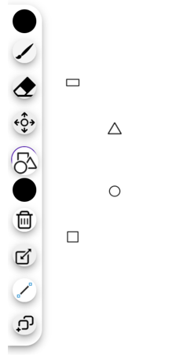

## Problem statement:

It’s required to design web paint program with implementing the concept of inheritance and polymorphism and applying 2 design patterns using Angular and Spring Boot.

## Preview:

## Features available in the program:

1. Drawing different shapes (Line Segment -straight and free hand drawing, Circle, Ellipse, Triangle, Rectangle and Square)

2. Removing, duplicating, Resizing, and Erasing.

3. Save and Load files inn different forms (json, xml)

## How to use the program:

First download the frontend code from "front" folder and download Angular CLI to be able to run the application. The rest instructions are in readme.md inside front folder. Second Download the backend from "back" folder and run the server through any IDE ex. IntelliJ and the app will run on port 8080. Last, start using the app.

The program is easy to use and learnable for all kind of users.  It achieves all design principles.

## Manual of Use:

1. The app is stating with simple memorable interface with toolbox on the left side of screen with simple understandable icons.

2. The user has variety of choices
He/she can choose the fill colour of shapes and the stroke colour from these plates of colour.
He/she can change the width of stroke using slider on the top of screen.
Any time the user gets confused he can just hover over the tool button for a second and the tooltip will appear with the tool name.
We achieve **fits law** while making circular menu of tools.

3. The app provides a safe experience. The user can undo or redo any change made any time.

4. The shapes are draggable so the user can drag any shape for any place on the screen.

5. The shapes can be resized from the shape itself.

6. To duplicate any shape, press duplicate button and choose the shape you want to duplicate.

7. There is a button to save the file and another one to load the saved files.

## Design Patterns Used:

- **Factory DP:** it’s applied in Shape-Factory.Service.ts in the front-end to create the different shapes

- **Prototype DP:** it’s used in the front-end represented in the function clone () which is a built-in function in the used library to make clone of any shape

- **Memento DP:** it’s used in the front-end just to handle saving operation, but it does not save actually, used in the back-end to do the saving

## Design Decisions:

· we used shape factory service to separate between the creation and the preview
· we used API service to separate between the requests and the code itself
· we used dependency induction to let the shapes separated and don’t need to be created each time
